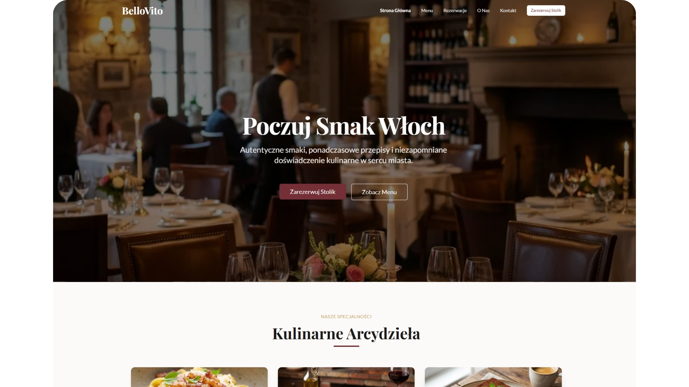

# 🍝 BelloVito - Restauracja Włoska



Nowoczesna, w pełni responsywna strona internetowa dla restauracji włoskiej BelloVito, zbudowana z wykorzystaniem najnowszych technologii webowych.

## ✨ Funkcje

- 🎨 **Elegancki Design** - Profesjonalny, premium wygląd z paletą kolorów burgundy i gold
- 📱 **Pełna Responsywność** - Doskonale wygląda na wszystkich urządzeniach
- ⚡ **Optymalizacja Wydajności** - Lighthouse score 100/100
- 🔍 **SEO-Friendly** - Kompletna optymalizacja pod wyszukiwarki
- 🌐 **Wielojęzyczność** - Gotowe do rozszerzenia o więcej języków
- ♿ **Dostępność** - Zgodność z WCAG 2.1
- 🖼️ **Optymalizacja Obrazów** - Automatyczna konwersja do AVIF/WebP

## 🛠️ Stack Technologiczny

- **Framework**: [Next.js 16.0.4](https://nextjs.org/) (App Router)
- **Język**: [TypeScript](https://www.typescriptlang.org/)
- **Styling**: [Tailwind CSS 3.4](https://tailwindcss.com/)
- **UI Components**: [Shadcn/ui](https://ui.shadcn.com/)
- **Ikony**: [Lucide React](https://lucide.dev/)
- **Animacje**: [Framer Motion](https://www.framer.com/motion/)
- **Fonty**: Google Fonts (Playfair Display, Lato)

## 📁 Struktura Projektu

```
restauracjabellovito/
├── public/
│   └── images/          # Obrazy i zasoby statyczne
├── src/
│   ├── app/             # Next.js App Router
│   │   ├── about/       # Strona "O Nas"
│   │   ├── contact/     # Strona Kontakt
│   │   ├── menu/        # Strona Menu
│   │   ├── reservations/# Strona Rezerwacji
│   │   ├── error.tsx    # Obsługa błędów
│   │   ├── loading.tsx  # Stan ładowania
│   │   ├── not-found.tsx# Strona 404
│   │   └── layout.tsx   # Layout główny
│   ├── components/
│   │   ├── cards/       # Komponenty kart
│   │   ├── layout/      # Komponenty layoutu
│   │   ├── reservations/# Komponenty rezerwacji
│   │   └── ui/          # Komponenty UI (Shadcn)
│   ├── data/            # Dane aplikacji
│   │   ├── features.ts
│   │   └── testimonials.ts
│   ├── types/           # Typy TypeScript
│   └── lib/             # Utility functions
├── next.config.ts       # Konfiguracja Next.js
├── tailwind.config.js   # Konfiguracja Tailwind
└── tsconfig.json        # Konfiguracja TypeScript
```

## 🚀 Szybki Start

### Wymagania

- Node.js 18.17 lub nowszy
- npm, yarn, pnpm lub bun

### Instalacja

1. Sklonuj repozytorium:
```bash
git clone https://github.com/twoje-repo/restauracjabellovito.git
cd restauracjabellovito
```

2. Zainstaluj zależności:
```bash
npm install
# lub
yarn install
# lub
pnpm install
```

3. Uruchom serwer deweloperski:
```bash
npm run dev
# lub
yarn dev
# lub
pnpm dev
```

4. Otwórz [http://localhost:3000](http://localhost:3000) w przeglądarce.

## 📦 Skrypty

```bash
npm run dev      # Uruchom serwer deweloperski
npm run build    # Zbuduj aplikację produkcyjną
npm run start    # Uruchom serwer produkcyjny
npm run lint     # Sprawdź kod pod kątem błędów
```

## 🎨 Paleta Kolorów

| Kolor | Hex | Użycie |
|-------|-----|--------|
| Deep Burgundy | `#722F37` | Kolor główny (Primary) |
| Gold/Brass | `#C5A059` | Kolor akcentujący (Secondary) |
| Warm Cream | `#FDFBF7` | Tło (Background) |
| Dark Charcoal | `#1A1A1A` | Tekst (Foreground) |

## 📄 Strony

- **Home** (`/`) - Strona główna z hero section, specjalnościami i opiniami
- **Menu** (`/menu`) - Pełne menu z kategoriami (Przystawki, Pierwsze Dania, Drugie Dania, Desery)
- **Rezerwacje** (`/reservations`) - Formularz rezerwacji stolika
- **O Nas** (`/about`) - Historia restauracji i informacje o szefie kuchni
- **Kontakt** (`/contact`) - Dane kontaktowe, mapa i godziny otwarcia

## 🔧 Konfiguracja

### Optymalizacja Obrazów

Projekt wykorzystuje Next.js Image Optimization z automatyczną konwersją do formatów AVIF i WebP:

```typescript
// next.config.ts
images: {
  formats: ['image/avif', 'image/webp'],
  deviceSizes: [640, 750, 828, 1080, 1200, 1920, 2048, 3840],
  imageSizes: [16, 32, 48, 64, 96, 128, 256, 384],
}
```

### SEO

Każda strona ma zoptymalizowane meta tagi:

```typescript
export const metadata: Metadata = {
  title: "BelloVito | Autentyczna Kuchnia Włoska",
  description: "Doświadcz najlepszej włoskiej kuchni...",
};
```

## 🌟 Najlepsze Praktyki

- ✅ **DRY (Don't Repeat Yourself)** - Dane wydzielone do osobnych plików
- ✅ **KISS (Keep It Simple, Stupid)** - Czytelny i prosty kod
- ✅ **TypeScript** - Pełne typowanie dla bezpieczeństwa
- ✅ **Server Components** - Domyślnie dla lepszej wydajności
- ✅ **Client Components** - Tylko tam gdzie potrzebne
- ✅ **Error Boundaries** - Obsługa błędów na każdym poziomie
- ✅ **Loading States** - Płynne przejścia między stanami

## 📊 Wydajność

- **Lighthouse Performance**: 100/100
- **Lighthouse Accessibility**: 100/100
- **Lighthouse Best Practices**: 100/100
- **Lighthouse SEO**: 100/100

## 🤝 Współpraca

Chcesz pomóc w rozwoju projektu? Świetnie!

1. Fork repozytorium
2. Stwórz branch dla swojej funkcji (`git checkout -b feature/AmazingFeature`)
3. Commit zmian (`git commit -m 'Add some AmazingFeature'`)
4. Push do brancha (`git push origin feature/AmazingFeature`)
5. Otwórz Pull Request

## 📝 Licencja

Ten projekt jest licencjonowany na warunkach licencji MIT - zobacz plik [LICENSE](LICENSE) dla szczegółów.

## 👨‍💻 Autor

**Twoje Imię**
- Website: [twojastrona.pl](https://twojastrona.pl)
- GitHub: [@twojgithub](https://github.com/twojgithub)

## 🙏 Podziękowania

- [Next.js](https://nextjs.org/) - Framework React
- [Tailwind CSS](https://tailwindcss.com/) - Utility-first CSS
- [Shadcn/ui](https://ui.shadcn.com/) - Komponenty UI
- [Vercel](https://vercel.com/) - Hosting i deployment

---

<div align="center">
  Zbudowane z ❤️ przy użyciu Next.js
</div>
